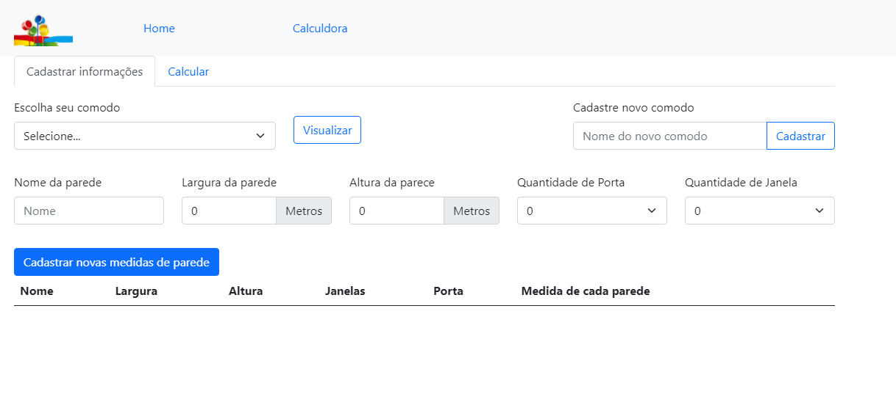
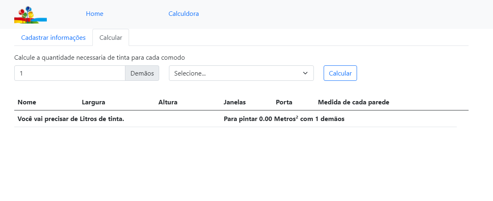

# Sistema para calcular o tanto de tinta necessaria para pintar um comodo

<h4 align="center"> 
	🚧  Em construção  🚧
</h4>  

É uma aplicação web que ajuda o usuário a calcular a quantidade de tinta necessária para pintar uma sala.

Essa aplicação considera que a sala é composta de 4 paredes e permite que o usuário escolha qual a medida de cada parede e quantas janelas e portas possuem cada parede.

Com base na quantidade necessária o sistema deve apontar tamanhos de lata de tinta 
que o usuário deve comprar, sempre priorizando as latas maiores. 
Ex: se o usuário precisa de 19 litros, ele deve sugerir 1 lata de 18L + 2 latas de 0,5L

## Regras de negócio

Nenhuma parede pode ter menos de 1 metro quadrado nem mais de 15 metros quadrados, mas podem possuir alturas e larguras diferentes
O total de área das portas e janelas deve ser no máximo 50% da área de parede
A altura de paredes com porta deve ser, no mínimo, 30 centímetros maior que a altura da porta
Cada janela possui as medidas: 2,00 x 1,20 mtos
Cada porta possui as medidas: 0,80 x 1,90
Cada litro de tinta é capaz de pintar 5 metros quadrados
Não considerar teto nem piso.
As variações de tamanho das latas de tinta são:

0,5 L
2,5 L
3,6 L
18 L

✨ Tecnologias utilizadas

* React 17.0.2
* Node.js 17.4.0
* Mysql 8.0.13
* Visual Studio code
* Laragon full 5.0.0 (Apache 2.4, PHP 7)

## Para que o sistema funcione corretamente é necessário que você tenha o Node.js instalado e um servidor PHP rodando 
## Instale algum servidor PHP de sua preferência 

* Laragon
* Wamp
* Lamp
* Xamp ...


## Clone este repositório em uma pasta do seu servidor local
```bash
$ git clone https://github.com/KellySoares/DR-React-PHP.git

```
## Acesse a pasta e instale as dependencias
```bash
$ cd DR-React-PHP/client
$ npm i
```

## Acesse a pasta client e rode o front-end
```bash
$ cd client
$ npm start

```

## Tela de cadastro

#### Na tela de cadastro é possível cadastrar comodos, cadastrar medidas da parede, quantidade de portas e janelas e visualizar comodos.




## Na tela de calcular

#### É possivel calcular a quantidade de tinta necessária para pintar o comodo. E também escolher quantos demãos são utilizados na pintura.


